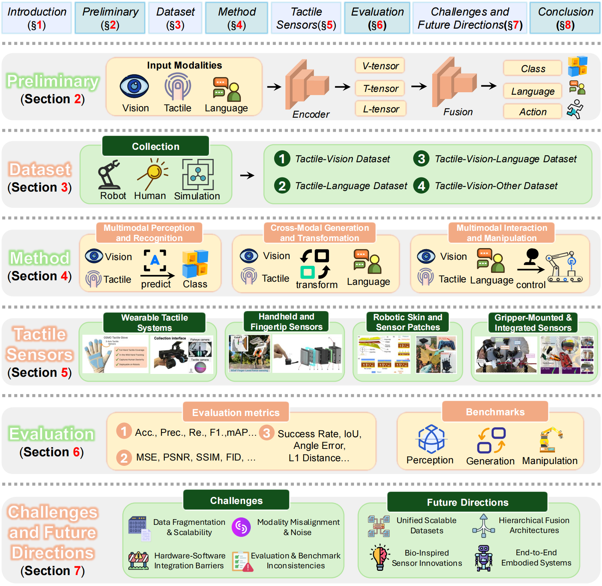
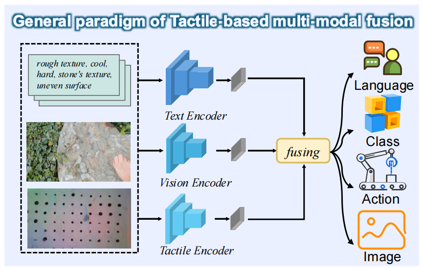
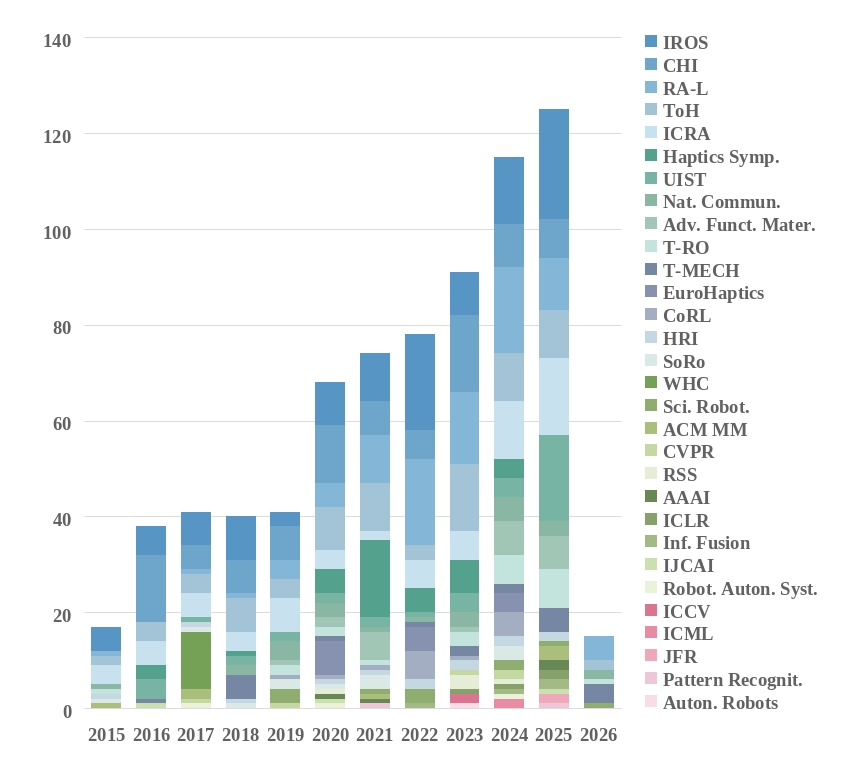
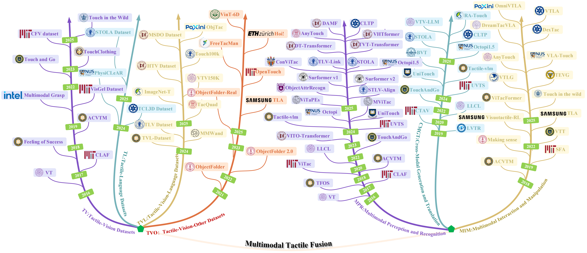
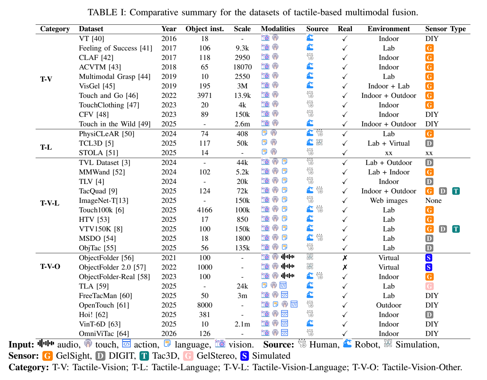
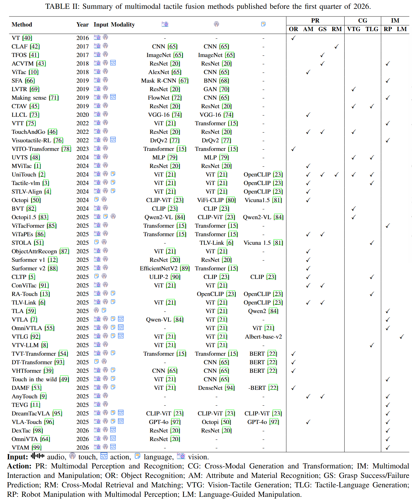
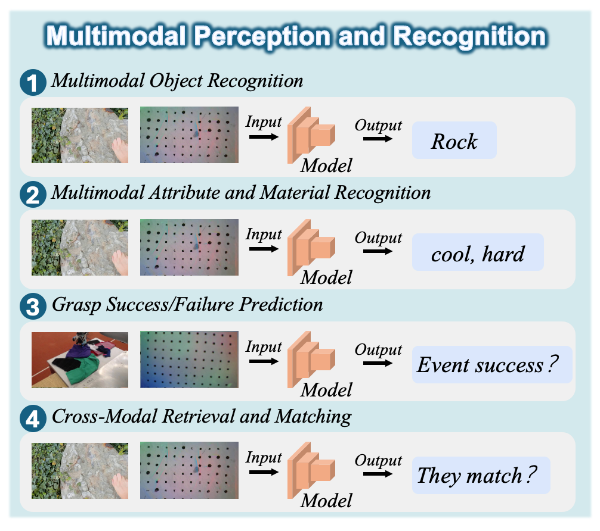
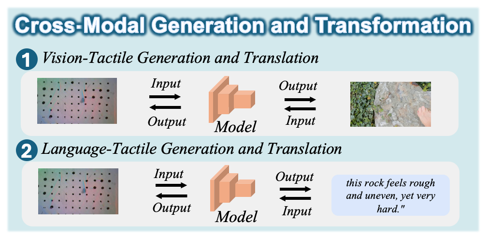
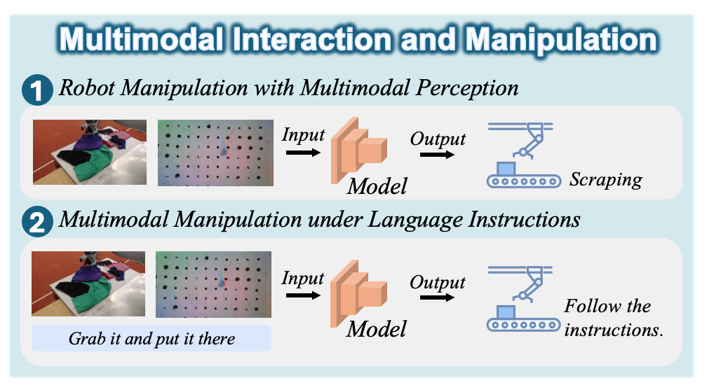

<div align="center">

## Tactile-based Multimodal Fusion in Embodied Intelligence: A Survey of Vision, Language, and Contact-Driven Paradigms

[]()

[](https://github.com/Wayne-coding/Multimodal-Tactile-Sensing-and-Fusion)

<a href="https://github.com/Wayne-coding/Multimodal-Tactile-Sensing-and-Fusion/issues"></a>

Zhixiang Cao<sup>1, 2</sup>, Di Tian<sup>1</sup>, Yanzhou Mu<sup>4</sup>, Xiaolou Sun<sup>5</sup>, Shaofeng Liang<sup>6</sup>, Daizong Liu<sup>7</sup>, Runwei Guan<sup>1*</sup>, Tao Huang<sup>8</sup>, Yutao Yue<sup>1</sup>, Henghui Ding<sup>10</sup>, Bin Fang<sup>9</sup>, Alex Zhou<sup>11</sup>, Qing-Long Han<sup>11</sup>, *Fellow, IEEE*, and Hui Xiong<sup>1*</sup>, *Fellow, IEEE*,


</div>

1. Thrust of Artificial Intelligence, The Hong Kong University of Science and Technology (Guangzhou), China
2. School of Electronic Science and Engineering, Xi'an Jiaotong University, China

3. State Key Laboratory for Novel Software Technology, Nanjing University, China
4. Purple Mountain Laboratory, China
5. College of Computer Science and Technology, China University of Petroleum (East China), China
6. Institute for Math & AI, Wuhan University, China
7. Centre for AI and Data Science Innovation and School of Science and Engineering, James Cook University, Australia
8. School of Artificial Intelligence, Beijing University of Posts and Telecommunications, China
9. Institute of Big Data, Fudan University, China
10. Linkerbot (Beijing) Technology Co., Ltd, China
11. School of Engineering, Swinburne University of Technology, Melbourne.

<sup>*</sup> Corresponding authors: `runwayrwguan@hkust-gz.edu.cn`, `xionghui@hkust-gz.edu.cn`

The official repository of our survey. We provide a comprehensive and structured review of **multimodal tactile sensing and fusion** across **vision-, language-, and contact-driven paradigms**. The figure below presents the overall organization of this survey, including **preliminary foundations, datasets, methods, tactile sensors, evaluation, and future directions**.

<div align="center">
  
</div>
If you find this repository useful, please consider starring this repo, and sharing it with others!

## Content

- [Definitions](#definitions)
- [Latest](#latest)
  - [Trends](#trends)
  - [Related Surveys](#related-surveys)
- [Taxonomy](#taxonomy)

- [Multimodal Datasets](#multimodal-datasets)
  - [Tactile-Vision Datasets](#tactile-vision-datasets)
  - [Tactile-Language Datasets](#tactile-language-datasets)
  - [Tactile-Vision-Language Datasets](#tactile-vision-language-datasets)
  - [Tactile-Vision-Other Datasets](#tactile-vision-other-datasets)

- [Multimodal Methods](#multimodal-methods)
  - [Multimodal Perception and Recognition](#multimodal-perception-and-recognition)
    - [Multimodal Object Recognition](#multimodal-object-recognition)
    - [Multimodal Attribute and Material Recognition](#multimodal-attribute-and-material-recognition)
    - [Grasp Success/Failure Prediction](#grasp-successfailure-prediction)
    - [Cross-Modal Retrieval and Matching](#cross-modal-retrieval-and-matching)
  - [Cross-Modal Generation and Transformation](#cross-modal-generation-and-transformation)
    - [Vision-Tactile Generation and Translation](#vision-tactile-generation-and-translation)
    - [Language-Tactile Generation and Translation](#language-tactile-generation-and-translation)
  - [Multimodal Interaction and Manipulation](#multimodal-interaction-and-manipulation)
    - [Robot Manipulation with Multimodal Perception](#robot-manipulation-with-multimodal-perception)
    - [Multimodal Manipulation under Language Instructions](#multimodal-manipulation-under-language-instructions)

- [Tactile Sensors](#tactile-sensors)
  - [Wearable Tactile Systems](#wearable-tactile-systems)
  - [Handheld and Fingertip Sensors](#handheld-and-fingertip-sensors)
  - [Robotic Skin and Sensor Patches](#robotic-skin-and-sensor-patches)
  - [Gripper-Mounted and Integrated Sensors](#gripper-mounted-and-integrated-sensors)

- [Citation](#citation)


As illustrated in the hierarchical taxonomy , we systematically organize multimodal tactile fusion into three primary pillars: **Multimodal Datasets**, **Multimodal Methods**, and **Tactile Sensors**.

The dataset pillar provides a comprehensive overview of available resources, including **Tactile-Vision datasets**, **Tactile-Language datasets**, **Tactile-Vision-Language datasets**, and **Tactile-Vision-Other datasets** that incorporate additional modalities such as action, audio, or proprioception.

The method pillar is structured into three core research categories:
**(1) Multimodal Perception and Recognition**, covering tasks such as material understanding, grasp-related prediction, and cross-modal retrieval;
**(2) Multimodal Cross-Modal Generation and Transformation**, focusing on bidirectional generation and translation between tactile signals and other modalities; and
**(3) Multimodal Interaction and Manipulation**, emphasizing contact-rich control and language-guided robotic manipulation.

In parallel, the hardware pillar categorizes tactile sensing platforms into four groups according to their physical embodiment and deployment settings: **wearable tactile systems**, **handheld and fingertip sensors**, **robotic skin and multimodal sensor patches**, and **gripper-mounted and integrated sensors**.

This structured perspective spans the full pipeline from hardware transduction to high-level reasoning, allowing us to examine current limitations and outline future directions toward general-purpose tactile intelligence.


## Problem Scope and Definition

- **Multimodal Tactile Fusion**
  Studies how tactile signals are integrated with other modalities, especially **vision** and **language**, to support **perception**, **generation**, and **interaction** in robotic systems.

- **Modal Configurations**
  We focus on three representative settings: **Tactile-Vision (T-V)**, **Tactile-Language (T-L)**, and **Tactile-Vision-Language (T-V-L)**.

- **Key Property**
  Unlike vision and language, tactile sensing is inherently **contact-driven**, meaning that information is acquired through physical interaction with the environment.

- **General Pipeline**
  A typical multimodal tactile system involves four stages: **physical transduction**, **modality-specific encoding**, **cross-modal fusion**, and **task-oriented decoding**.

<div align="center"></div>

## Latest

### Trends

To analyze the development of **multimodal tactile fusion**, we collect relevant papers from major journals and conferences in **robotics, computer vision, haptics, and multimodal learning**. We retain studies that combine **tactile sensing** with at least one additional modality under **data-driven** or **learning-based** settings.

As illustrated by the publication trend, the number of relevant works has increased steadily over the past decade, with a clear acceleration after **2020**. Early studies were mainly published in robotics and haptics venues, while more recent works have expanded into broader vision and multimodal research communities. This trend reflects the growing recognition of tactile sensing as an essential modality for **multimodal perception, interaction, and embodied intelligence**.


<div align="center"></div>


### Related Surveys

A small number of recent surveys are related to **multimodal tactile sensing and fusion**, covering topics such as **touch transformers** and **visuo-tactile data generation**. Our survey provides a broader and more systematic review of the field, spanning **datasets, methods, tactile sensors, evaluation, challenges, and future directions** across **vision-, language-, and contact-driven paradigms**.

#### Multimodal Tactile Fusion
- **Transformer in Touch: A Survey**, *May 2024* [[Paper](https://arxiv.org/abs/2405.12779)]
- **Tactile Data Generation and Applications Based on Visuo-Tactile Sensors: A Review**, *Sep 2025* [[Paper](https://www.sciencedirect.com/science/article/pii/S1566253525002350)]

## Taxonomy


As illustrated in the hierarchical taxonomy , we systematically organize multimodal tactile fusion into three primary pillars: **Multimodal Datasets**, **Multimodal Methods**, and **Tactile Sensors**.

The dataset pillar provides a comprehensive overview of available resources, including **Tactile-Vision datasets**, **Tactile-Language datasets**, **Tactile-Vision-Language datasets**, and **Tactile-Vision-Other datasets** that incorporate additional modalities such as action, audio, or proprioception.

The method pillar is structured into three core research categories:
**(1) Multimodal Perception and Recognition**, covering tasks such as material understanding, grasp-related prediction, and cross-modal retrieval;
**(2) Multimodal Cross-Modal Generation and Transformation**, focusing on bidirectional generation and translation between tactile signals and other modalities; and
**(3) Multimodal Interaction and Manipulation**, emphasizing contact-rich control and language-guided robotic manipulation.

In parallel, the hardware pillar categorizes tactile sensing platforms into four groups according to their physical embodiment and deployment settings: **wearable tactile systems**, **handheld and fingertip sensors**, **robotic skin and multimodal sensor patches**, and **gripper-mounted and integrated sensors**.

This structured perspective spans the full pipeline from hardware transduction to high-level reasoning, allowing us to examine current limitations and outline future directions toward general-purpose tactile intelligence.


## Timelines

Organized by major taxonomy categories and chronological order, the figure highlights the developmental trajectory of multimodal tactile fusion and shows how the field has expanded across perception, generation, and interaction tasks.

<div align="center"></div>


## Multimodal Datasets

<div align="center"></div>


### Tactile-Vision Datasets

* **VT**: "Visual–tactile fusion for object recognition", *2016* [[Paper](https://ieeexplore.ieee.org/abstract/document/7462208)]

* **Feeling of Success**: "The Feeling of Success: Does Touch Sensing Help Predict Grasp Outcomes?", *2017* [[Paper](https://arxiv.org/abs/1710.05512)][[Code](https://github.com/robertocalandra/the-feeling-of-success)]

* **CLAF**: "Connecting Look and Feel: Associating the Visual and Tactile Properties of Physical Material", *2017* [[Paper](https://openaccess.thecvf.com/content_cvpr_2017/papers/Yuan_Connecting_Look_and_CVPR_2017_paper.pdf)]

* **ACVTM**: "More than a feeling:Learning to grasp and regrasp using vision and touch", *2018* [[Paper](https://arxiv.org/pdf/1805.11085)]

* **Multimodal Grasp**: "Multimodal grasp data set: A novel visual–tactile data set for robotic manipulation", *2019* [[Paper](https://journals.sagepub.com/doi/full/10.1177/1729881418821571)][[Code](https://github.com/tsinghua-rll/Visual-Tactile_Dataset)] 

* **VisGel**: "Connecting touch and vision via cross-modal prediction", *2019* [[Paper](https://openaccess.thecvf.com/content_CVPR_2019/papers/Li_Connecting_Touch_and_Vision_via_Cross-Modal_Prediction_CVPR_2019_paper.pdf)][[Code](https://github.com/YunzhuLi/VisGel)] 

* **Touch and Go**: "Touch and go: Learning from human-collected vision and touch", *2022* [[Paper](https://arxiv.org/pdf/2211.12498)][[Code](https://github.com/fredfyyang/Touch-and-Go)] 

* **TouchClothing**: "Controllable visual-tactile synthesis", *2023* [[Paper](https://openaccess.thecvf.com/content/ICCV2023/papers/Gao_Controllable_Visual-Tactile_Synthesis_ICCV_2023_paper.pdf)][[Code](https://github.com/RuihanGao/visual-tactile-synthesis)] 

* **CFV**: "Learning to jointly understand visual and tactile signals", *2023* [[Paper](https://openreview.net/pdf?id=NtQqIcSbqv)][[Data](https://sites.google.com/view/iclr-submission-force-vision/home?authuser=3)]

* **Touch in the Wild**: "Touch in the wild: Learning fine-grained manipulation with a portable visuo-tactile gripper", *2025* [[Paper](https://arxiv.org/pdf/2507.15062)][[Code](https://github.com/YolandaXinyueZhu/touch_in_the_wild)] 


### Tactile-Language Datasets

* **PhysiCLeAR**: "Octopi: Object property reasoning with large tactile-language models", *2024* [[Paper](https://arxiv.org/pdf/2405.02794)][[Code](https://github.com/clear-nus/octopi)] 

* **TCL3D**: "Cltp: Contrastive language-tactile pre-training for 3d contact geometry understanding", *2025* [[Paper](https://www.sciencedirect.com/science/article/pii/S2667379726000525)][[Code](https://sites.google.com/view/cltp/)]

* **STOLA**: "Stola: Self-adaptive touch-language framework with tactile commonsense reasoning in open-ended scenarios", *2025* [[Paper](https://ojs.aaai.org/index.php/AAAI/article/view/38882)][[Code](https://github.com/cocacola-lab/STOLA)] 

### Tactile-Vision-Language Datasets

* **TVL Dataset**: "A touch, vision, and language dataset for multimodal alignment", *2024* [[Paper](https://arxiv.org/pdf/2402.13232)][[Code](https://github.com/Max-Fu/tvl)] 

* **MMWand**: "Multi-modal representation learning with tactile data", *2024* [[Paper](https://ieeexplore.ieee.org/abstract/document/10802699)][[Data](https://hyung-gun.me/mmwand/)]

* **TLV**: "Towards comprehensive multimodal perception: Introducing the touch-language-vision dataset", *2024* [[Paper](https://arxiv.org/pdf/2403.09813)][[Code](https://github.com/xiaoen0/touch)] 

* **TacQuad**: "Anytouch: Learning unified static-dynamic representation across multiple visuo-tactile sensor", *2025* [[Paper](https://arxiv.org/pdf/2502.12191)][[Code](https://github.com/GeWu-Lab/AnyTouch)] 

* **ImageNet‑T**: "Ra-touch: Retrieval-augmented touch understanding with enriched visual data", *2025* [[Paper](https://dl.acm.org/doi/abs/10.1145/3746027.3755106)][[Code](https://github.com/AIM-SKKU/RA-Touch)] 

* **Touch100k**: "Touch100k: A large-scale touch-language-vision dataset for touch-centric multimodal representation", *2025* [[Paper](https://www.sciencedirect.com/science/article/pii/S1566253525003781)][[Code](https://github.com/cocacola-lab/TLV-Link)] 

* **HTV**: "Damf: A semantic-guided dynamic attention framework for visual-haptic-textual multimodal fusion", *2025* [[Paper](https://www.sciencedirect.com/science/article/pii/S0950705125012857)]

* **VTV150K**: "Universal visuo-tactile video understanding for embodied interaction", *2025* [[Paper](https://arxiv.org/pdf/2505.22566)]

* **MSDO**: "Tvt-transformer: A tactile-visual-textual fusion network for object recognition", *2025* [[Paper](https://www.sciencedirect.com/science/article/pii/S1566253525000168)][[Code](https://github.com/huakaichengbei/MSDO/tree/master)] 

* **ObjTac**: "Omnivtla: Vision-tactile-language-action model with semantic-aligned tactile sensing", *2025* [[Paper](https://arxiv.org/pdf/2508.08706)][[Data](https://drive.google.com/drive/folders/1jamNGWYhCk-uVKtrleF55WUpHctmOQBH)]

### Tactile-Vision-Other Datasets

* **ObjectFolder**: "Objectfolder: A dataset of objects with implicit visual, auditory, and tactile representations", *2021* [[Paper](https://arxiv.org/pdf/2109.07991)]

* **ObjectFolder 2.0**: "Objectfolder 2.0: A multisensory object dataset for sim2real transfer", *2022* [[Paper](https://ai.stanford.edu/~rhgao/objectfolder2.0/ObjectFolderV2_Supp.pdf)][[Code](https://github.com/rhgao/ObjectFolder)]

* **ObjectFolder‑Real**: "The objectfolder benchmark: Multisensory learning with neural and real objects", *2023* [[Paper](https://ieeexplore.ieee.org/abstract/document/10203718)][[Data](https://objectfolder.stanford.edu/objectfolder-real)]

* **TLA**: "Tla: Tactile-language-action model for contact-rich manipulation", *2025* [[Paper](https://arxiv.org/pdf/2503.08548)][[Code](https://sites.google.com/view/tactile-language-action/)]

* **FreeTacMan**: "Freetacman: Robot-free visuo-tactile data collection system for contact-rich manipulation", *2025* [[Paper](https://arxiv.org/pdf/2506.01941)][[Code](https://github.com/OpenDriveLab/FreeTacMan)] 

* **OpenTouch**: "Opentouch:Bringing full-hand touch to real-world interaction", *2025* [[Paper](https://arxiv.org/pdf/2512.16842)][[Code](https://github.com/OpenTouch-MIT/opentouch)] 

* **Hoi!**: "Hoi!–a multimodal dataset for force-grounded, cross-view articulated manipulation", *2025* [[Paper](https://arxiv.org/pdf/2512.04884)][[Example Data](https://drive.google.com/drive/folders/1Hzpt5WXFbUg0CNVU7gudH-4z-HkC6kGR)]

* **VinT‑6D**: "Vint-6d: A large-scale object-in-hand dataset from vision, touch and proprioception", *2025* [[Paper](https://arxiv.org/pdf/2501.00510)][[Data](https://huggingface.co/datasets/vint6d/vint6d)]

* **OmniViTac**: "OmniVTA: Visuo-Tactile World Modeling for Contact-Rich Robotic Manipulation", *2026* [[Paper](https://arxiv.org/pdf/2603.19201)][[Code](https://github.com/MrSecant/OmniVTA)] 

## Multimodal Methods
<div align="center"></div>


### Multimodal Perception and Recognition

<div align="center"></div>


#### Multimodal Object Recognition

* **VT**: "Visual–tactile fusion for object recognition", *2016* [[Paper](https://ieeexplore.ieee.org/abstract/document/7462208)]

* **VITO-Transformer**: "Vito-transformer:a visual-tactile fusion network for object recognition", *2023* [[Paper](https://ieeexplore.ieee.org/abstract/document/10288485)]

* **TVT-Transformer**: "Tvt-transformer: A tactile-visual-textual fusion network for object recognition", *2025* [[Paper](https://www.sciencedirect.com/science/article/pii/S1566253525000168)][[Code](https://github.com/huakaichengbei/MSDO/tree/master)] 

* **DT-Transformer**: "Dt-transformer:A text-tactile fusion network for object recognition", *2025* [[Paper](https://ieeexplore.ieee.org/abstract/document/10767416/)]

* **VHTformer**: "Vhtformer: A joint query perception method for visual- haptic-textual information based on transformer", *2025* [[Paper](https://www.sciencedirect.com/science/article/pii/S1568494625008403)]

* **DAMF**: "Damf: A semantic-guided dynamic attention framework for visual-haptic-textual multimodal fusion", *2025* [[Paper](https://www.sciencedirect.com/science/article/pii/S0950705125012857)]

#### Multimodal Attribute and Material Recognition
* **ViTac**: "Vitac: Feature sharing between vision and tactile sensing for cloth texture recognition", *2018* [[Paper](https://ieeexplore.ieee.org/abstract/document/8460494)]

* **LLCL**: "Lifelong visual-tactile cross- modal learning for robotic material perception", *2020* [[Paper](https://ieeexplore.ieee.org/abstract/document/9062383)]

* **TouchAndGo**: "Touch and go: Learning from human-collected vision and touch", *2022* [[Paper](https://arxiv.org/pdf/2211.12498)][[Code](https://github.com/fredfyyang/Touch-and-Go)] 

* **MVTac**: "Multimodal visual-tactile representation learning through self-supervised contrastive pre-training", *YEAR TBD* [[Paper](https://ieeexplore.ieee.org/abstract/document/10610228)][[Code](https://github.com/ligerfotis/mvitac)] 

* **UniTouch**: "Binding Touch to Everything: Learning Unified Multimodal Tactile Representations", *2024* [[Paper](https://openaccess.thecvf.com/content/CVPR2024/papers/Yang_Binding_Touch_to_Everything_Learning_Unified_Multimodal_Tactile_Representations_CVPR_2024_paper.pdf)][[Code](https://github.com/cfeng16/UniTouch)] 

* **Tactile‑VLM**: "A touch, vision, and language dataset for multimodal alignment", *2024* [[Paper](https://arxiv.org/pdf/2402.13232)][[Code](https://github.com/Max-Fu/tvl)] 

* **STLV‑Align**: "Towards comprehensive multimodal perception: Introducing the touch-language-vision dataset", *2024* [[Paper](https://arxiv.org/pdf/2403.09813)][[Code](https://github.com/xiaoen0/touch)] 

* **Octopi**: "Octopi: Object property reasoning with large tactile-language models", *2024* [[Paper](https://arxiv.org/pdf/2405.02794)][[Code](https://github.com/clear-nus/octopi)] 

* **ViTApEs**: "Vitapes: Visuotactile position encodings for cross-modal alignment in multimodal transformers", *2025* [[Paper](https://arxiv.org/pdf/2505.20032)][[Code](https://sites.google.com/view/vitapes)]

* **ObjectAttrRecogn**: "Object attribute recognition method integrating visual-tactile data and multi-task learning", *2025* [[Paper](https://ieeexplore.ieee.org/abstract/document/11175298)][[Code](https://github.com/CdpLab/ObjectAttrRecogn)] 

* **Surformer v1**: "Surformer v1: Transformer-based surface classification using tactile and vision features", *2025* [[Paper](https://www.mdpi.com/2078-2489/16/10/839)]

* **Surformer v2**: "Surformer v2: A multimodal classifier for surface understanding from touch and vision", *2025* [[Paper](https://arxiv.org/pdf/2509.04658)]

* **ConViTac**: "Convitac: Aligning visual-tactile fusion with contrastive representations", *2025* [[Paper](https://ieeexplore.ieee.org/abstract/document/11245928)][[Code](https://github.com/GeorgeWuzy/ConViTac)] 

* **TLV‑Link**: "Touch100k: A large-scale touch-language-vision dataset for touch-centric multimodal representation", *2025* [[Paper](https://www.sciencedirect.com/science/article/pii/S1566253525003781)][[Code](https://github.com/cocacola-lab/TLV-Link)] 

* **AnyTouch**: "Anytouch: Learning unified static-dynamic representation across multiple visuo-tactile sensors", *2025* [[Paper](https://arxiv.org/pdf/2502.12191)][[Code](https://github.com/GeWu-Lab/AnyTouch)] 

* **VLA‑Touch**: "Vla-touch:Enhancing vision-language-action models with dual-level tactile feedback, ", *2025* [[Paper](https://arxiv.org/pdf/2507.17294)][[Code](https://github.com/jxbi1010/VLA-Touch)] 

#### Grasp Success/Failure Prediction

* **TFOS**: "The feeling of success:Does touch sensing help predict grasp outcomes?", *2017* [[Paper](https://arxiv.org/abs/1710.05512)][[Code](https://github.com/robertocalandra/the-feeling-of-success)] 

* **ACVTM**: "More than a feeling:Learning to grasp and regrasp using vision and touch", *2018* [[Paper](https://ieeexplore.ieee.org/abstract/document/8403291)]

* **TouchAndGo**: "Touch and go: Learning from human-collected vision and touch", *2022* [[Paper](https://arxiv.org/pdf/2211.12498)][[Code](https://github.com/fredfyyang/Touch-and-Go)] 

* **UniTouch**: "Binding Touch to Everything: Learning Unified Multimodal Tactile Representations", *2024* [[Paper](https://openaccess.thecvf.com/content/CVPR2024/papers/Yang_Binding_Touch_to_Everything_Learning_Unified_Multimodal_Tactile_Representations_CVPR_2024_paper.pdf)][[Code](https://github.com/cfeng16/UniTouch)] 

* **ViTApEs**: "Vitapes: Visuotactile position encodings for cross-modal alignment in multimodal transformers", *2025* [[Paper](https://arxiv.org/pdf/2505.20032)][[Code](https://sites.google.com/view/vitapes)]

* **ConViTac**: "Convitac: Aligning visual-tactile fusion with contrastive representations", *2025* [[Paper](https://ieeexplore.ieee.org/abstract/document/11245928)][[Code](https://github.com/GeorgeWuzy/ConViTac)] 

* **TLV‑Link**: "Touch100k: A large-scale touch-language-vision dataset for touch-centric multimodal representation", *2025* [[Paper](https://www.sciencedirect.com/science/article/pii/S1566253525003781)][[Code](https://github.com/cocacola-lab/TLV-Link)] 

* **AnyTouch**: "Anytouch: Learning unified static-dynamic representation across multiple visuo-tactile sensors", *2025* [[Paper](https://arxiv.org/pdf/2502.12191)][[Code](https://github.com/GeWu-Lab/AnyTouch)] 

#### Cross-Modal Retrieval and Matching

* **CLAF**: "Connecting Look and Feel: Associating the Visual and Tactile Properties of Physical Material", *2017* [[Paper](https://openaccess.thecvf.com/content_cvpr_2017/papers/Yuan_Connecting_Look_and_CVPR_2017_paper.pdf)]

* **UniTouch**: "Binding Touch to Everything: Learning Unified Multimodal Tactile Representations", *2024* [[Paper](https://openaccess.thecvf.com/content/CVPR2024/papers/Yang_Binding_Touch_to_Everything_Learning_Unified_Multimodal_Tactile_Representations_CVPR_2024_paper.pdf)][[Code](https://github.com/cfeng16/UniTouch)] 

### Cross-Modal Generation and Transformation

<div align="center"></div>


#### Vision-Tactile Generation and Translation
* **LVTR**: "Learning cross-modal visual-tactile representation using ensembled generative adversarial networks", *2019* [[Paper](https://ietresearch.onlinelibrary.wiley.com/doi/full/10.1049/ccs.2018.0014)]

* **CTAV**: "Connecting touch and vision via cross-modal prediction", *2019* [[Paper](https://openaccess.thecvf.com/content_CVPR_2019/papers/Li_Connecting_Touch_and_Vision_via_Cross-Modal_Prediction_CVPR_2019_paper.pdf)][[Code](https://github.com/YunzhuLi/VisGel)] 

* **TouchAndGo**: "Touch and go: Learning from human-collected vision and touch", *2022* [[Paper](https://arxiv.org/pdf/2211.12498)][[Code](https://github.com/fredfyyang/Touch-and-Go)] 

* **UVTS**: "Learning to jointly understand visual and tactile signals", *2023* [[Paper](https://openreview.net/pdf?id=NtQqIcSbqv)][[Data](https://sites.google.com/view/iclr-submission-force-vision/home?authuser=3)]

* **UniTouch**: "Binding Touch to Everything: Learning Unified Multimodal Tactile Representations", *2024* [[Paper](https://openaccess.thecvf.com/content/CVPR2024/papers/Yang_Binding_Touch_to_Everything_Learning_Unified_Multimodal_Tactile_Representations_CVPR_2024_paper.pdf)][[Code](https://github.com/cfeng16/UniTouch)] 

* **BVT**: "Bidirectional visual-tactile cross-modal generation using latent feature space flow model", *2024* [[Paper](https://www.sciencedirect.com/science/article/pii/S0893608023007499)]

* **Octopi1.5**: "Demonstrating the Octopi-1.5 Visual-Tactile-Language Model", *2025* [[Paper](https://arxiv.org/pdf/2507.09985)][[Code](https://github.com/clear-nus/octopi-1.5)] 

#### Language-Tactile Generation and Translation

* **CTAV**: "Connecting touch and vision via cross-modal prediction", *2019* [[Paper](https://openaccess.thecvf.com/content_CVPR_2019/papers/Li_Connecting_Touch_and_Vision_via_Cross-Modal_Prediction_CVPR_2019_paper.pdf)][[Code](https://github.com/YunzhuLi/VisGel)] 

* **UVTS**: "Learning to jointly understand visual and tactile signals", *2023* [[Paper](https://openreview.net/pdf?id=NtQqIcSbqv)][[Data](https://sites.google.com/view/iclr-submission-force-vision/home?authuser=3)]

* **UniTouch**: "Binding Touch to Everything: Learning Unified Multimodal Tactile Representations", *2024* [[Paper](https://openaccess.thecvf.com/content/CVPR2024/papers/Yang_Binding_Touch_to_Everything_Learning_Unified_Multimodal_Tactile_Representations_CVPR_2024_paper.pdf)][[Code](https://github.com/cfeng16/UniTouch)] 

* **Tactile‑VLM**: "A touch, vision, and language dataset for multimodal alignment", *2024* [[Paper](https://arxiv.org/pdf/2402.13232)][[Code](https://github.com/Max-Fu/tvl)] 

* **STOLA**: "Stola: Self-adaptive touch-language framework with tactile commonsense reasoning in open-ended scenarios", *2025* [[Paper](https://ojs.aaai.org/index.php/AAAI/article/view/38882)][[Code](https://github.com/cocacola-lab/STOLA)] 

* **CLTP**: "Cltp: Contrastive language-tactile pre-training for 3d contact geometry understanding", *2025* [[Paper](https://www.sciencedirect.com/science/article/pii/S2667379726000525)][[Code](https://sites.google.com/view/cltp/)]

* **RA‑Touch**: " Ra-touch: Retrieval-augmented touch understanding with enriched visual data", *2025* [[Paper](https://dl.acm.org/doi/abs/10.1145/3746027.3755106)][[Code](https://github.com/AIM-SKKU/RA-Touch)] 

* **VTV‑LLM**: "Universal visuo-tactile video understanding for embodied interaction", *2025* [[Paper](https://arxiv.org/pdf/2505.22566)]

### Multimodal Interaction and Manipulation

<div align="center"></div>


#### Robot Manipulation with Multimodal Perception

* **ACVTM**: "More than a feeling:Learning to grasp and regrasp using vision and touch", *2018* [[Paper](https://arxiv.org/pdf/1805.11085)]

* **SFA**: "See, feel, act: Hierarchical learning for complex manipulation skills with multisensory fusion", *2019* [[Paper](https://www.science.org/doi/full/10.1126/scirobotics.aav3123)]

* **Making‑sense**: "Making sense of vision and touch: Self-supervised learning of multimodal representations for contact-rich tasks", *2019* [[Paper](https://ieeexplore.ieee.org/abstract/document/8793485)]

* **VTT**: "Visuo-tactile transformers for manipulation", *2022* [[Paper](https://arxiv.org/pdf/2210.00121)][[Code](https://github.com/https://github.com/YizhouChen7045/Visuo-Tactile-Transformers-for-Manipulation)] 

* **Visuotactile‑RL**: "Visuotactile-rl: Learning multimodal manipulation policies with deep reinforcement learning", *2022* [[Paper](https://ieeexplore.ieee.org/abstract/document/9812019)]

* **ViTacFormer**: "Vitacformer: Learning cross-modal representation for visuo-tactile dexterous manipulation", *2025* [[Paper](https://arxiv.org/pdf/2506.15953)]

* **TLA**: "Tla: Tactile-language-action model for contact-rich manipulation", *2025* [[Paper](https://arxiv.org/pdf/2503.08548)][[Code](https://sites.google.com/view/tactile-language-action/)]

* **VTLA**: "Vtla: Vision-tactile-language-action model with preference learning for insertion manipulation", *YEAR TBD* [[Paper](https://arxiv.org/pdf/2505.09577)]

* **ObjTac**: "Omnivtla: Vision-tactile-language-action model with semantic-aligned tactile sensing", *2025* [[Paper](https://arxiv.org/pdf/2508.08706)][[Data](https://drive.google.com/drive/folders/1jamNGWYhCk-uVKtrleF55WUpHctmOQBH)]

* **Touch in the Wild**: "Touch in the wild: Learning fine-grained manipulation with a portable visuo-tactile gripper", *2025* [[Paper](https://arxiv.org/pdf/2507.15062)][[Code](https://github.com/YolandaXinyueZhu/touch_in_the_wild)] 

* **AnyTouch**: "Anytouch: Learning unified static-dynamic representation across multiple visuo-tactile sensors", *2025* [[Paper](https://arxiv.org/pdf/2502.12191)][[Code](https://github.com/GeWu-Lab/AnyTouch)] 

* **TEVG**: "Can vision feel touch? tactile-aware visual grasping for transparent objects", *2025* [[Paper](https://ieeexplore.ieee.org/abstract/document/11124252)]

* **DreamTacVLA**: "Learning to feel the future: Dreamtacvla for contact-rich manipulation", *2025* [[Paper](https://arxiv.org/pdf/2512.23864)]

* **VLA‑Touch**: "Vla-touch:Enhancing vision-language-action models with dual-level tactile feedback, ", *2025* [[Paper](https://arxiv.org/pdf/2507.17294)][[Code](https://github.com/jxbi1010/VLA-Touch)] 

* **DexTac**: "Dextac: Learning contact-aware visuotactile policies via hand-by-hand teaching", *2026* [[Paper](https://arxiv.org/pdf/2601.21474)]

* **OmniVTA**: "OmniVTA: Visuo-Tactile World Modeling for Contact-Rich Robotic Manipulation", *2026* [[Paper](https://arxiv.org/pdf/2603.19201)][[Code](https://github.com/MrSecant/OmniVTA)] 

* **VTAM**: "VTAM: Video-Tactile-Action Models for Complex Physical Interaction Beyond VLAs, *2026* [[Paper](https://arxiv.org/abs/2603.23481)]

#### Multimodal Manipulation under Language Instructions

* **VTLG**: "Vtlg: A vision-tactile-language grasp generation method oriented towards task", *2025* [[Paper](https://www.sciencedirect.com/science/article/pii/S0736584525002066)]

## Tactile Sensors

### Wearable Tactile Systems

*  "A glove-based system for object recognition via visual-tactile fusion", *2019* [[Paper](http://scis.scichina.com/en/2019/050203.pdf)]
 
* "Osmo: Open-source tactile glove for human-to-robot skill transfer", *2025* [[Paper](https://arxiv.org/abs/2512.08920)]
 
* "Freetacman: Robot-free visuo-tactile data collection system for contact-rich manipulation", *2025* [[Paper](https://arxiv.org/abs/2506.01941)]

### Handheld and Fingertip Sensors

* "A novel multi-modal tactile sensor design using thermochromic material", *2019* [[Paper](http://scis.scichina.com/en/2019/214201.pdf)]

* "A Compact Visuo-Tactile Robotic Skin for Micron-Level Tactile Perception", *2024* [[Paper](https://ieeexplore.ieee.org/abstract/document/10474279)]
 
*  "LightTact: A Visual-Tactile Fingertip Sensor for Deformation-Independent Contact Sensing", *2025* [[Paper](https://arxiv.org/abs/2512.20591)]

* "Simultaneous Tactile-Visual Perception for Learning Multimodal Robot Manipulation", *2025* [[Paper](https://ieeexplore.ieee.org/abstract/document/11425767)]

* "MagicGel: A Novel Visual-Based Tactile Sensor Design with Magnetic Gel", *2025* [[Paper](https://ieeexplore.ieee.org/abstract/document/11246423)]
 
* "A braille detection system based on visuo-tactile sensing", *2025* [[Paper](https://www.sciencedirect.com/science/article/pii/S0263224125001861)]
 
* "Touch in the wild: Learning fine-grained manipulation with a portable visuo-tactile gripper", *2025* [[Paper](https://arxiv.org/abs/2507.15062)]

* "In-the-Wild Compliant Manipulation with UMI-FT", *2026* [[Paper](https://arxiv.org/abs/2601.09988)]

### Robotic Skin and Sensor Patches

*  "Multimodal tactile sensing fused with vision for dexterous robotic housekeeping", *2024* [[Paper](https://www.nature.com/articles/s41467-024-51261-5)]
 
* "A Large-area Tactile Sensor for Distributed Force Sensing Using Highly Sensitive Piezoresistive Sponge", *2024* [[Paper](https://ieeexplore.ieee.org/abstract/document/10610739)]
 
* "Biomimetic hydrogel-based sensors with dual-mode dynamic-static tactile sensing capability enabling robotic hand for intelligent material property recognition", *2025* [[Paper](https://onlinelibrary.wiley.com/doi/full/10.1002/inf2.70041)]

* "A Large-Area Robotic Skin for Intelligent Tactile Interaction of Collaborative Robots", *2025* [[Paper](https://ieeexplore.ieee.org/abstract/document/10836225)]

* "A Biomimetic Ionic Hydrogel Synapse for Self-Powered Tactile-Visual Fusion Perception", *2025* [[Paper](https://advanced.onlinelibrary.wiley.com/doi/abs/10.1002/adfm.202500048)]
 
* "Pollen-Biochar-Based Tactile-Pain Dual-Function Sensors for Intelligent Robotics", *2025* [[Paper](https://advanced.onlinelibrary.wiley.com/doi/abs/10.1002/adfm.202522727)]
 
* "Biomimetic multimodal tactile sensing enables human-like robotic perception", *2026* [[Paper](https://www.nature.com/articles/s44460-025-00006-y)]
 
### Gripper-Mounted and Integrated Sensors

* "Multimodal tactile sensing fused with vision for dexterous robotic housekeeping", *2024* [[Paper](https://www.nature.com/articles/s41467-024-51261-5)]

* "A Compact Visuo-Tactile Robotic Skin for Micron-Level Tactile Perception", *2024* [[Paper](https://ieeexplore.ieee.org/abstract/document/10474279)]

* "Touch in the wild: Learning fine-grained manipulation with a portable visuo-tactile gripper", *2025* [[Paper](https://arxiv.org/abs/2507.15062)]
 
* "LightTact: A Visual-Tactile Fingertip Sensor for Deformation-Independent Contact Sensing", *2025* [[Paper](https://arxiv.org/abs/2512.20591)]
 
* "Simultaneous Tactile-Visual Perception for Learning Multimodal Robot Manipulation", *2025* [[Paper](https://ieeexplore.ieee.org/abstract/document/11425767)]
 
* "TacUMI: A Multi-Modal Universal Manipulation Interface for Contact-Rich Tasks", *2026* [[Paper](https://arxiv.org/abs/2601.14550)]
 
## Citation
Thank you for your interest! If you find our work helpful, please consider citing us with:
```bibtex
xx
```
